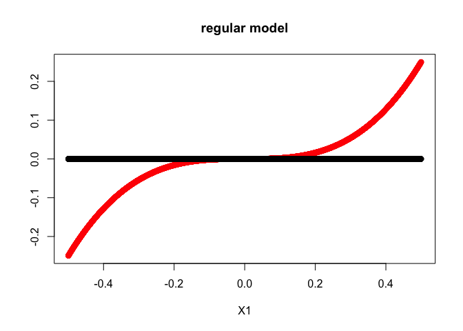
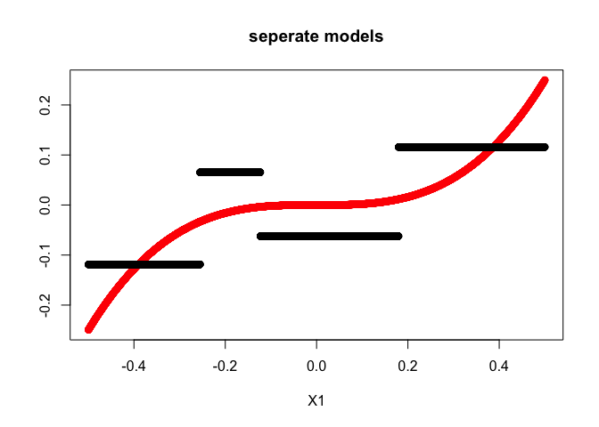

segmenTree package
================
Iyar Lin
26 April, 2020

The segmenTree package implements a decision tree based algorithm for
exploration of heterogeneous treatment effects in Randomised Controlled
Trial data. It uses the rpart package as the backend with a predifined
method on top.

You can install and load the package from github using:

``` r
pacman::p_load_gh("IyarLin/segmenTree")
```

Let’s generate a dataset:

``` r
set.seed(1) # vary this and the sample size to get a sense of the model performance
# Generate a dataset
p_x <- function(Tr, X1, X2, X3){
  lp <- 2*X1 + 0.2*X2 + as.numeric(X3)/6
  0.25 + 2*Tr*X1^3 + 0.5*exp(lp)/(1+exp(lp))
}

n <- 10000
Tr <- rbinom(n, 1, 0.3)
X1 <- runif(n, -0.5, 0.5)
X2 <- rnorm(n)
X3 <- factor(sample(LETTERS[1:3], size = n, replace = T))
p <- p_x(Tr, X1, X2, X3)
y <- sapply(p, function(x) rbinom(1, 1, x))
y_mat <- cbind(y, Tr)
dat <- data.frame(y = I(y_mat), X1, X2, X3)
```

Next, let’s import the lift method and use rpart to fit a segment tree:

``` r
lift_method <- import_lift_method()
segment_tree <- rpart(y ~ ., data = dat,
              method = lift_method,
              control = rpart.control(cp = 0),
              parms = list(), y = T, x = T)
```

Next, we prune the tree. The package includesd 2 functions to do so:
`tune_cp` and `cp_elbow`. We’ll use the `cp_elbow` function which uses
the elbow method along with elbow strength to find the optimal cp:

``` r
optimal_cp <- cp_elbow(segment_tree)
```

<!-- -->

``` r
# prune:
segment_tree <- prune(segment_tree, cp = optimal_cp)
```

Let’s explore the resulting segments:

``` r
segments <- extract_segments(segment_tree, alpha = 0.15)
pander::pandoc.table(segments, split.tables = Inf)
```

|       |              segment               |  n   |   lift   | lift\_lower | lift\_upper |
| :---: | :--------------------------------: | :--: | :------: | :---------: | :---------: |
| **3** | X1\>=0.1796,X1\<0.499855161411688  | 3202 | 0.09588  |   0.06995   |   0.1218    |
| **2** |      X1\>=-0.2554,X1\<0.1796       | 4328 | \-0.0161 |  \-0.03973  |  0.007539   |
| **1** | X1\>=-0.49972922494635,X1\<-0.2554 | 2470 | \-0.1061 |  \-0.1365   |  \-0.07558  |

Let’s compare the estimated lift (in black) vs the true lift (in red):

``` r
tau <- predict(segment_tree, dat)
p_treat <- p_x(rep(1, n), X1, X2, X3)
p_cont <- p_x(rep(0, n), X1, X2, X3)
cate <- p_treat - p_cont

y_lim <- c(min(tau, cate), max(tau, cate))
plot(c(min(dat$X1), max(dat$X1)), y_lim, type = "n", main = "segmenTree",
     xlab = "X1", ylab = "true (red) vs predicted (black) lift")
points(dat$X1, cate, col = "red")
points(dat$X1, tau)
```

<!-- -->

Just to get a sense of why we need this kind of model, let’s try to
estimate lift by modelling both the treatment and covariates:

``` r
dat2 <- data.frame(y, X1, X2, X3, Tr)
fit2 <- rpart(y ~ ., data = dat2)

dat2_treat <- dat2; dat2_cont <- dat2
dat2_treat$Tr <- 1L; dat2_cont$Tr <- 0L
tau2 <- predict(fit2, dat2_treat) - predict(fit2, dat2_cont)

y_lim <- c(min(tau2, cate), max(tau2, cate))
plot(c(min(dat$X1), max(dat$X1)), y_lim, type = "n", main = "regular model",
     xlab = "X1", ylab = "")
points(dat$X1, cate, col = "red")
points(dat$X1, tau2)
```

<!-- -->

Let’s also try fitting a seperate model for treatment and control:

``` r
dat3_treat <- dat2[dat2$Tr == 1, -5]
dat3_cont <- dat2[dat2$Tr == 0, -5]

fit3_treat <- rpart(y ~ ., data = dat3_treat)
fit3_cont <- rpart(y ~ ., data = dat3_cont)
dat2_treat <- dat2; dat2_cont <- dat2
tau3 <- predict(fit3_treat, dat2) - predict(fit3_cont, dat2)

y_lim <- c(min(tau3, cate), max(tau3, cate))
plot(c(min(dat$X1), max(dat$X1)), y_lim, type = "n", main = "seperate models",
     xlab = "X1", ylab = "")
points(dat$X1, cate, col = "red")
points(dat$X1, tau3)
```

<!-- -->
